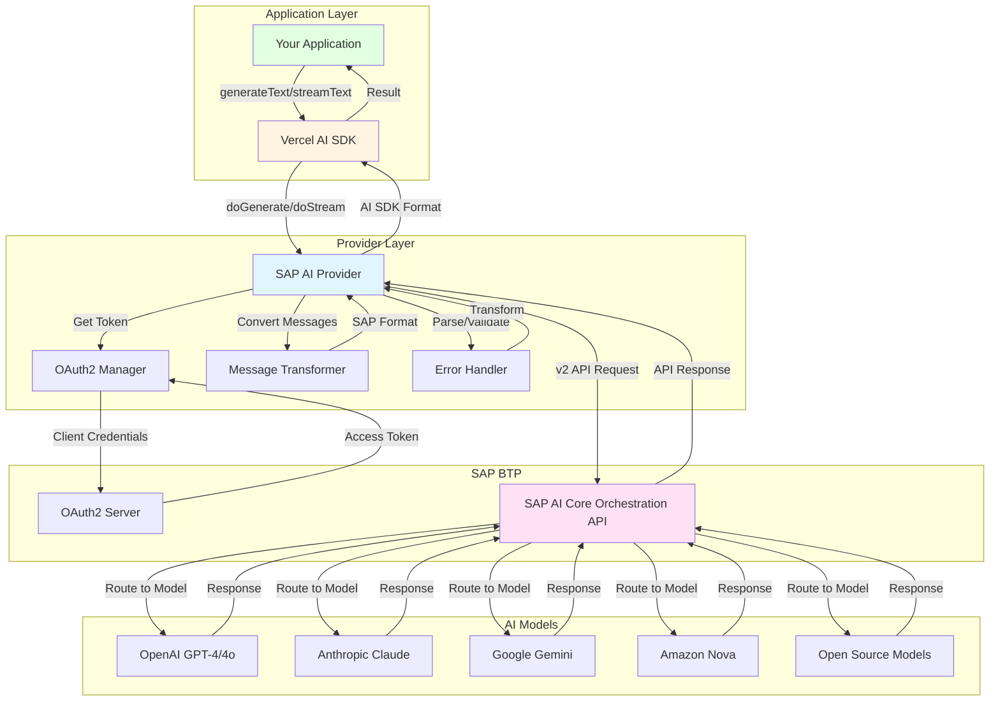
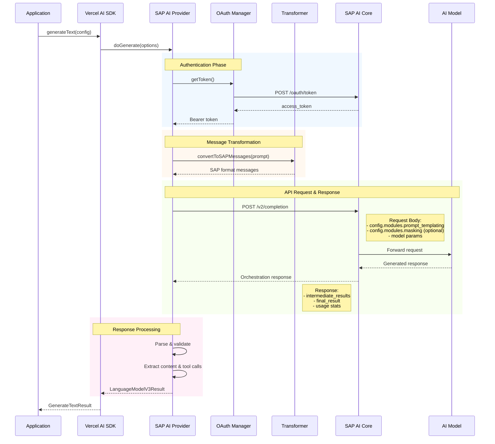
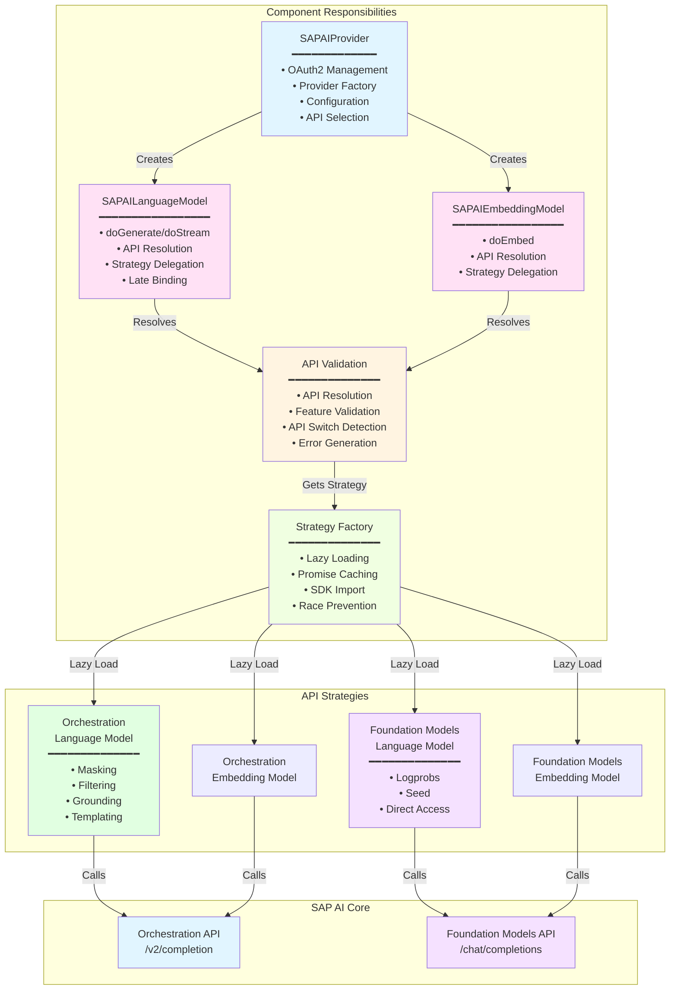
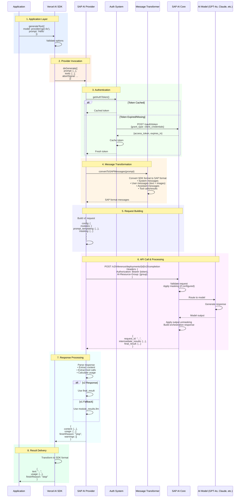
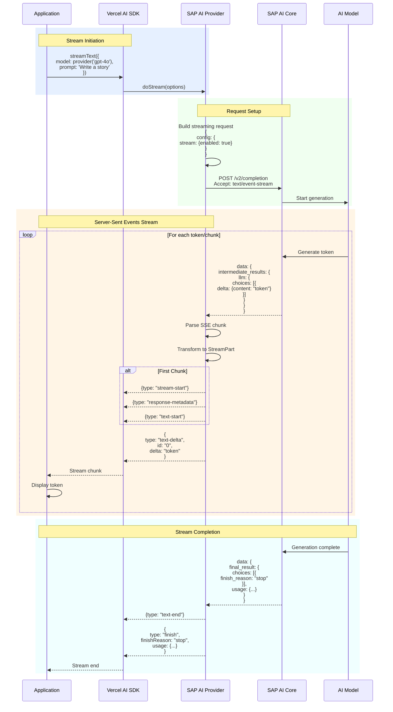
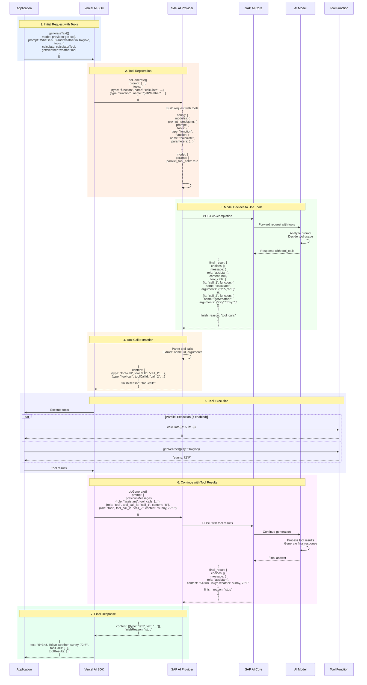
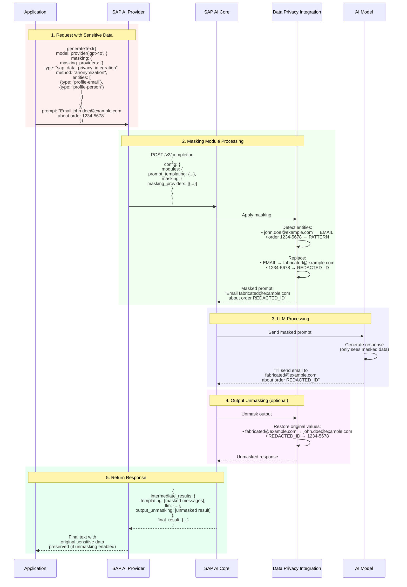
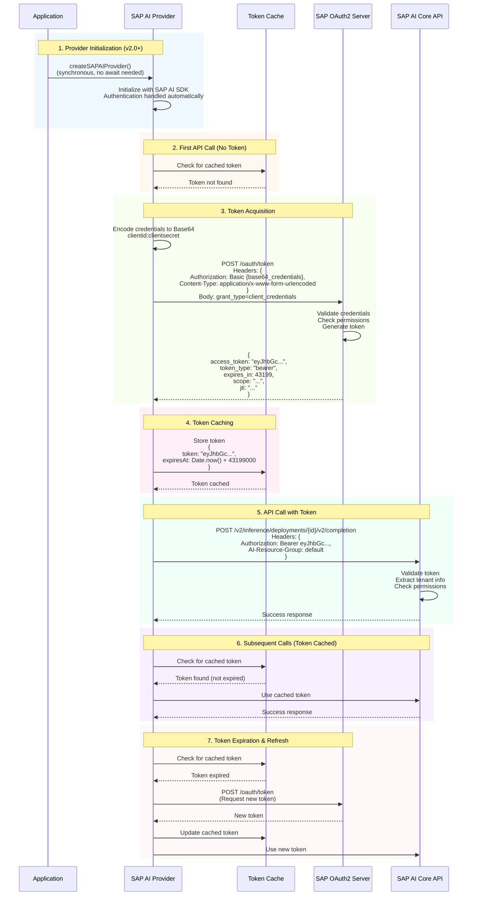
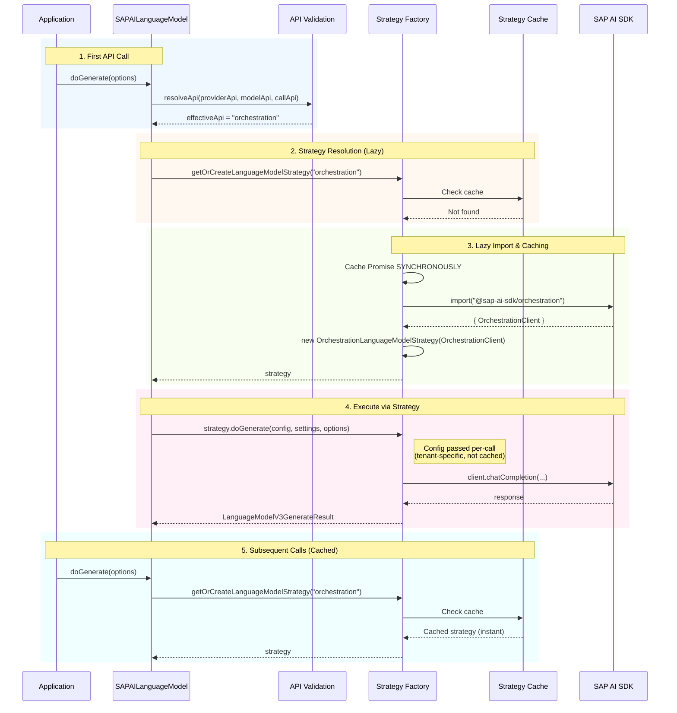

# SAP AI Core Provider Architecture

This document provides a detailed overview of the SAP AI Core Provider's
architecture, internal components, and integration patterns.

**For general usage**, see [README](./README.md). **For API documentation**,
see [API Reference](./API_REFERENCE.md).

## TL;DR (Executive Summary)

**3-layer architecture** bridging your application to SAP AI services:

- **Application** → **Provider** → **SAP AI Core** → AI Models
- Implements Vercel AI SDK's `ProviderV3` interface
- Uses SAP AI SDK (`@sap-ai-sdk/orchestration` and `@sap-ai-sdk/foundation-models`) for API communication
- Transforms messages bidirectionally (AI SDK ↔ SAP format)
- Supports streaming, tool calling, multi-modal, data masking, and embeddings

**Key Components:** Provider → OAuth Manager → Message Transformer → Error
Handler → SAP AI Core API

## Table of Contents

- [TL;DR (Executive Summary)](#tldr-executive-summary)
- [Overview](#overview)
  - [High-Level Architecture](#high-level-architecture)
  - [Component Interaction Flow](#component-interaction-flow)
  - [Key Design Principles](#key-design-principles)
- [Component Architecture](#component-architecture)
  - [Component Interaction Map](#component-interaction-map)
  - [Detailed Component Flow](#detailed-component-flow)
  - [Component Responsibilities](#component-responsibilities)
    - [`SAPAIProvider`](#sapaiprovider)
    - [`SAPAILanguageModel`](#sapailanguagemodel)
    - [`Authentication System`](#authentication-system)
    - [`Message Conversion`](#message-conversion)
- [Request/Response Flow](#requestresponse-flow)
  - [Standard Text Generation (Complete Flow)](#standard-text-generation-complete-flow)
  - [Streaming Text Generation (SSE Flow)](#streaming-text-generation-sse-flow)
  - [Orchestration v2 Endpoint](#orchestration-v2-endpoint)
  - [Request Structure (v2)](#request-structure-v2)
  - [Response Structure (v2)](#response-structure-v2)
  - [Templating and Tools (v2)](#templating-and-tools-v2)
  - [Data Masking Module (v2)](#data-masking-module-v2)
  - [Request Cancellation](#request-cancellation)
  - [Tool Calling Flow](#tool-calling-flow)
  - [Data Masking Flow (SAP DPI Integration)](#data-masking-flow-sap-dpi-integration)
- [Authentication System](#authentication-system-1)
  - [OAuth2 Authentication Flow](#oauth2-authentication-flow)
  - [OAuth2 Flow](#oauth2-flow)
- [Error Handling](#error-handling)
  - [Error Conversion Architecture](#error-conversion-architecture)
  - [Error Classification](#error-classification)
  - [Retry Mechanism](#retry-mechanism)
  - [User-Facing Error Handling (v3.0.0+)](#user-facing-error-handling-v300)
- [Type System](#type-system)
  - [Model Configuration Types](#model-configuration-types)
  - [Request/Response Schemas](#requestresponse-schemas)
- [Integration Patterns](#integration-patterns)
  - [Provider Pattern](#provider-pattern)
  - [Adapter Pattern](#adapter-pattern)
  - [Strategy Pattern (Dual API Support)](#strategy-pattern-dual-api-support)
- [Performance Considerations](#performance-considerations)
  - [Request Optimization](#request-optimization)
  - [Memory Management](#memory-management)
  - [Monitoring and Observability](#monitoring-and-observability)
  - [Scalability Patterns](#scalability-patterns)
- [See Also](#see-also)

## Overview

The SAP AI Core Provider is designed as a bridge between the Vercel AI SDK and
SAP AI Core services. It implements the Vercel AI SDK's `ProviderV3` interface
while handling the complexities of SAP AI Core's API, authentication, and data
formats.

### High-Level Architecture

The diagram below illustrates the complete architecture of the SAP AI Provider,
showing how it integrates your application with SAP AI Core through the Vercel
AI SDK. The provider layer handles OAuth2 authentication, message transformation
between AI SDK and SAP formats, and error handling. SAP AI Core routes requests
to various AI models (OpenAI GPT, Anthropic Claude, Google Gemini, Amazon Nova,
and open-source models).



### Component Interaction Flow

This sequence diagram shows the complete request lifecycle from your application
through the AI SDK and provider to SAP AI Core. The flow is divided into four
phases: Authentication (OAuth2 token retrieval), Message Transformation
(converting AI SDK format to SAP format), API Request & Response (communication
with SAP AI Core and the AI model), and Response Processing (parsing and
converting back to AI SDK format).



### Key Design Principles

1. **Compatibility**: Full compatibility with Vercel AI SDK interfaces
2. **Type Safety**: Comprehensive TypeScript types for all operations
3. **Error Resilience**: Robust error handling with automatic retries
4. **Performance**: Efficient request handling and response streaming
5. **Security**: Secure authentication and credential management

## Component Architecture

### Component Interaction Map

This diagram details the responsibilities of each major component in the
provider architecture, including the SAPAIProvider (OAuth2 management,
configuration), SAPAILanguageModel (request/response handling, tool calls),
Authentication System (token management), Message Transformer (format
conversion), API Client (HTTP communication), and Error Handling system.



### Detailed Component Flow

```text
src/
├── index.ts                                        # Public API exports
├── sap-ai-provider.ts                              # Main provider factory
├── sap-ai-provider-options.ts                      # Provider options & Zod schemas
├── sap-ai-language-model.ts                        # Language model (API-agnostic)
├── sap-ai-embedding-model.ts                       # Embedding model (API-agnostic)
├── sap-ai-settings.ts                              # Settings and type definitions
├── sap-ai-error.ts                                 # Error handling system
├── sap-ai-validation.ts                            # API resolution & validation
├── sap-ai-strategy.ts                              # Strategy factory (lazy loading)
├── strategy-utils.ts                               # Shared strategy utilities
├── orchestration-language-model-strategy.ts       # Orchestration API strategy
├── orchestration-embedding-model-strategy.ts      # Orchestration embedding strategy
├── foundation-models-language-model-strategy.ts   # Foundation Models API strategy
├── foundation-models-embedding-model-strategy.ts  # Foundation Models embedding strategy
├── convert-to-sap-messages.ts                     # Message format conversion
├── deep-merge.ts                                   # Deep merge utility
└── version.ts                                      # Package version constant
```

### Component Responsibilities

#### `SAPAIProvider`

- **Purpose**: Factory for creating language and embedding model instances
- **Responsibilities**:
  - Authentication management
  - Configuration validation
  - Model instance creation (language and embedding)
  - Base URL and deployment management

#### `SAPAILanguageModel`

- **Purpose**: Implementation of Vercel AI SDK's `LanguageModelV3`
- **Responsibilities**:
  - Request/response transformation
  - Streaming support
  - Tool calling implementation
  - Multi-modal input handling

#### `SAPAIEmbeddingModel`

- **Purpose**: Implementation of Vercel AI SDK's `EmbeddingModelV3`
- **Responsibilities**:
  - Embedding generation via `doEmbed()`
  - Batch size validation (`maxEmbeddingsPerCall`)
  - AbortSignal handling for request cancellation
  - Uses `OrchestrationEmbeddingClient` from SAP AI SDK

#### `Authentication System`

- **Purpose**: OAuth2 token management for SAP AI Core
- **Responsibilities**:
  - Service key parsing
  - Token acquisition and refresh
  - Credential validation

#### `Message Conversion`

- **Purpose**: Format translation between AI SDK and SAP AI Core
- **Responsibilities**:
  - Prompt format conversion
  - Multi-modal content handling
  - Tool call format transformation

## Request/Response Flow

### Standard Text Generation (Complete Flow)

This detailed sequence diagram shows the complete flow for a standard text
generation request, including all steps from application call through
authentication, message transformation, SAP AI Core API communication, and
response processing back to the application.



### Streaming Text Generation (SSE Flow)

This diagram illustrates the streaming text generation flow using Server-Sent
Events (SSE). Unlike standard generation, streaming returns partial responses
incrementally as the AI model generates content, enabling real-time display of
results to users.



### Orchestration v2 Endpoint

SAP AI Core Orchestration v2 introduces a more structured API with improved
capabilities:

**Default Path:**

```text
${baseURL}/inference/deployments/{deploymentId}/v2/completion
```

**Top-level v2 endpoint:**

```http
POST /v2/completion
```

([documentation](https://api.sap.com/api/ORCHESTRATION_API_v2/resource/Orchestrated_Completion))

**Configuration:**

```typescript
// Default configuration
const provider = createSAPAIProvider({
  resourceGroup: "default",
});

// With specific deployment
const provider = createSAPAIProvider({
  deploymentId: "d65d81e7c077e583",
  resourceGroup: "production",
});
```

### Request Structure (v2)

The v2 API uses a modular configuration structure:

```typescript
{
  config: {
    modules: {
      prompt_templating: {
        prompt: {
          template: [ /* messages */ ],
          defaults: { /* placeholder defaults */ },
          response_format: { /* text | json_object | json_schema */ },
          tools: [ /* function definitions */ ]
        },
        model: {
          name: "gpt-4o",
          version: "latest",
          params: {
            temperature: 0.7,
            max_tokens: 2000,
            // ... other params
          }
        }
      },
      masking: { /* optional DPI configuration */ }
    },
    stream: { /* optional streaming config */ }
  },
  placeholder_values: { /* optional values for template placeholders */ },
  messages_history: [ /* optional conversation history */ ]
}
```

### Response Structure (v2)

```typescript
{
  request_id: "uuid",
  intermediate_results: {
    templating: [ /* resolved messages */ ],
    llm: {
      id: "chatcmpl-xxx",
      object: "chat.completion",
      created: 1234567890,
      model: "gpt-4o-2024-08-06",
      choices: [{
        index: 0,
        message: {
          role: "assistant",
          content: "response text",
          tool_calls: [ /* if any */ ]
        },
        finish_reason: "stop"
      }],
      usage: {
        prompt_tokens: 100,
        completion_tokens: 50,
        total_tokens: 150
      }
    },
    output_unmasking: [ /* if masking enabled */ ]
  },
  final_result: { /* same structure as llm result */ }
}
```

### Templating and Tools (v2)

**Prompt Templating:**

- Messages are passed under `config.modules.prompt_templating.prompt.template`
- Supports system, user, assistant, tool, and developer roles
- Multi-modal content (text + images) supported

**Response Format:**

```typescript
// Text (default when no tools)
response_format: { type: "text" }

// JSON object
response_format: { type: "json_object" }

// JSON schema (structured output)
response_format: {
  type: "json_schema",
  json_schema: {
    name: "user_profile",
    description: "User profile schema",
    schema: {
      type: "object",
      properties: { /* JSON schema */ },
      required: [ /* required fields */ ]
    },
    strict: true
  }
}
```

**Tool Definitions:**

```typescript
tools: [
  {
    type: "function",
    function: {
      name: "calculator",
      description: "Perform arithmetic operations",
      parameters: {
        type: "object",
        properties: {
          operation: { type: "string", enum: ["add", "subtract"] },
          a: { type: "number" },
          b: { type: "number" },
        },
        required: ["operation", "a", "b"],
      },
    },
  },
];
```

### Data Masking Module (v2)

The masking module integrates with SAP Data Privacy Integration (DPI):

```typescript
modules: {
  prompt_templating: { /* ... */ },
  masking: {
    masking_providers: [{
      type: "sap_data_privacy_integration",
      method: "anonymization",  // or "pseudonymization"
      entities: [
        {
          type: "profile-email",
          replacement_strategy: { method: "fabricated_data" }
        },
        {
          type: "profile-person",
          replacement_strategy: { method: "constant", value: "REDACTED" }
        },
        {
          regex: "\\b[0-9]{4}-[0-9]{4}\\b",
          replacement_strategy: { method: "constant", value: "ID_REDACTED" }
        }
      ],
      allowlist: ["SAP", "BTP"],
      mask_grounding_input: { enabled: false }
    }]
  }
}
```

**Masking Flow:**

1. Input passes through masking module
2. Sensitive data is anonymized/pseudonymized
3. Masked data sent to LLM
4. Response passes through output_unmasking (if configured)
5. Original values restored in final output

### Request Cancellation

The provider supports HTTP-level request cancellation via `AbortSignal`.

**Non-streaming:**

```typescript
const response = await client.chatCompletion(requestBody, options.abortSignal ? { signal: options.abortSignal } : undefined);
```

**Streaming:**

```typescript
const stream = await client.stream(requestBody, options.abortSignal, streamOptions, requestConfig);
```

The signal passes through `requestConfig` to the SAP AI SDK, which forwards it to the underlying Axios HTTP client. When aborted, the HTTP connection is closed and server-side processing stops.

### Tool Calling Flow

This diagram shows how tool calling (function calling) works. When the AI model
needs to call a tool, it returns structured tool call requests. Your application
executes the tools and provides results back, which the model uses to generate
the final response.



### Data Masking Flow (SAP DPI Integration)

This diagram illustrates how SAP Data Privacy Integration (DPI) works. When
enabled, sensitive data in prompts is automatically masked before being sent to
AI models, and the masked entities are tracked and unmasked in responses.



## Authentication System

### OAuth2 Authentication Flow

This diagram shows how OAuth2 authentication works with token caching. The
provider checks for a valid cached token first; if expired or missing, it
requests a new token using client credentials, caches it, and uses it for API
requests.



### OAuth2 Flow

Authentication is handled automatically by the SAP AI SDK packages:

- **Local**: `AICORE_SERVICE_KEY` environment variable
- **SAP BTP**: `VCAP_SERVICES` service binding

The SDK manages credentials, token acquisition, caching, and refresh internally.

## Error Handling

The provider implements robust error handling by converting SAP AI SDK errors to
standard Vercel AI SDK error types for consistent error handling across
providers.

### Error Conversion Architecture

```typescript
// Internal error handling in doGenerate/doStream
try {
  const response = await client.chatCompletion({ messages });
  // Process response...
} catch (error) {
  // Convert to AI SDK standard errors
  throw convertToAISDKError(error, {
    operation: "doGenerate",
    url: "sap-ai:orchestration",
    requestBody: requestSummary,
  });
}
```

### Error Classification

The `convertToAISDKError()` function handles error conversion with a clear
priority:

1. **Already AI SDK error?** → Return as-is (no conversion needed)
2. **SAP Orchestration error?** → Convert to `APICallError` with details
   extracted from response
3. **Network/auth errors?** → Classify as `LoadAPIKeyError` or `APICallError`
   with appropriate status code
4. **Unknown error?** → Generic `APICallError` with status 500

All errors include helpful context (operation, URL, request body summary) for
debugging.

### Retry Mechanism

The provider marks errors as retryable based on HTTP status codes (aligned with
Vercel AI SDK defaults):

- **408 (Request Timeout)**: `isRetryable: true` → Retry after timeout
- **409 (Conflict)**: `isRetryable: true` → Retry on transient conflicts
- **429 (Rate Limit)**: `isRetryable: true` → Exponential backoff
- **5xx (Server Errors)**: `isRetryable: true` → Exponential backoff
- **400 (Bad Request)**: `isRetryable: false` → Client must fix request
- **401/403 (Auth Errors)**: `isRetryable: false` → Fix credentials
- **404 (Not Found)**: `isRetryable: false` → Fix model/deployment

The Vercel AI SDK handles retry logic automatically based on the `isRetryable`
flag.

### User-Facing Error Handling (v3.0.0+)

This provider converts all SAP AI Core errors to standard Vercel AI SDK
error types:

- **401/403 (Authentication)** → `LoadAPIKeyError`
- **404 (Model/Deployment not found)** → `NoSuchModelError`
- **Other HTTP errors** → `APICallError` with SAP metadata in `responseBody`

**Breaking change in v3.0.0:** The custom `SAPAIError` class was removed to
ensure full compatibility with the AI SDK ecosystem and enable automatic retry
mechanisms.

**For implementation details and code examples:**

- [API Reference - Error Handling Examples](./API_REFERENCE.md#error-handling-examples) -
  Complete examples with all error types
- [Troubleshooting Guide](./TROUBLESHOOTING.md#parsing-sap-error-metadata-v300) -
  Quick reference and common issues

**For v2→v3 migration**, see
[Migration Guide - v2 to v3](./MIGRATION_GUIDE.md#version-2x-to-3x-breaking-changes).

## Type System

### Model Configuration Types

Key types for model configuration:

- **`SAPAIModelId`**: String union of supported models (e.g., "gpt-4o",
  "claude-3.5-sonnet", "gemini-1.5-pro") with flexibility for custom models
- **`SAPAISettings`**: Interface with `modelVersion`, `modelParams` (maxTokens,
  temperature, topP, etc.), `safePrompt`, and `structuredOutputs` options

See `src/sap-ai-settings.ts` for complete type definitions.

### Request/Response Schemas

All API interactions use types from `@sap-ai-sdk/orchestration` and
`@sap-ai-sdk/foundation-models`, validated for type safety. Key types include:

- `ChatCompletionRequest`: Orchestration config and input parameters
- `OrchestrationResponse`: API responses with module results
- `ChatMessage`: Message format (role, content, tool calls)
- `ChatCompletionTool`: Function definitions and parameters

See `src/sap-ai-settings.ts` for the main settings interface and re-exported SAP
AI SDK types.

## Integration Patterns

### Provider Pattern

The provider implements the factory pattern for model creation:

```typescript
interface SAPAIProvider extends ProviderV3 {
  // Function call syntax
  (modelId: SAPAIModelId, settings?: SAPAISettings): SAPAILanguageModel;

  // Method call syntax
  chat(modelId: SAPAIModelId, settings?: SAPAISettings): SAPAILanguageModel;
}
```

### Adapter Pattern

The message conversion system adapts between Vercel AI SDK format and SAP AI
Core format. The `convertToSAPMessages()` function transforms prompt arrays,
handling text content, images, tool calls, and tool results across different
message formats.

### Strategy Pattern (Dual API Support)

The provider uses the Strategy Pattern with lazy loading to support two SAP AI
Core APIs: **Orchestration API** and **Foundation Models API**. This enables
feature-rich orchestration capabilities or direct model access depending on
your needs.

#### Architecture Overview

```mermaid
graph TB
    subgraph "Application Layer"
        App[Your Application]
        SDK[Vercel AI SDK]
    end

    subgraph "Provider Layer"
        Provider[SAPAIProvider]
        LM[SAPAILanguageModel]
        EM[SAPAIEmbeddingModel]
        Validation[API Resolution<br/>& Validation]
    end

    subgraph "Strategy Layer"
        Factory[Strategy Factory<br/>━━━━━━━━━━━━━<br/>• Lazy Loading<br/>• Promise Caching<br/>• SDK Import]
        Cache[(Strategy Cache<br/>Key: API Type)]
    end

    subgraph "Language Model Strategies"
        LMStrategy[LanguageModelAPIStrategy<br/>━━━━━━━━━━━━━━━━━━<br/>interface:<br/>• doGenerate()<br/>• doStream()]
        OrchLM[OrchestrationLanguageModelStrategy]
        FMLM[FoundationModelsLanguageModelStrategy]
    end

    subgraph "Embedding Model Strategies"
        EMStrategy[EmbeddingModelAPIStrategy<br/>━━━━━━━━━━━━━━━━━━<br/>interface:<br/>• doEmbed()]
        OrchEM[OrchestrationEmbeddingModelStrategy]
        FMEM[FoundationModelsEmbeddingModelStrategy]
    end

    subgraph "SAP AI SDKs"
        OrchSDK[@sap-ai-sdk/orchestration<br/>━━━━━━━━━━━━━━━━━━<br/>• OrchestrationClient<br/>• OrchestrationEmbeddingClient]
        FMSDK[@sap-ai-sdk/foundation-models<br/>━━━━━━━━━━━━━━━━━━<br/>• AzureOpenAiChatClient<br/>• AzureOpenAiEmbeddingClient]
    end

    App -->|generateText/streamText| SDK
    SDK -->|doGenerate/doStream| LM
    SDK -->|doEmbed| EM

    Provider -->|creates| LM
    Provider -->|creates| EM

    LM -->|resolveApi| Validation
    EM -->|resolveApi| Validation
    Validation -->|api type| Factory

    Factory -->|cache check| Cache
    Factory -->|lazy import| OrchLM
    Factory -->|lazy import| FMLM
    Factory -->|lazy import| OrchEM
    Factory -->|lazy import| FMEM

    LMStrategy -.->|implements| OrchLM
    LMStrategy -.->|implements| FMLM
    EMStrategy -.->|implements| OrchEM
    EMStrategy -.->|implements| FMEM

    OrchLM -->|uses| OrchSDK
    OrchEM -->|uses| OrchSDK
    FMLM -->|uses| FMSDK
    FMEM -->|uses| FMSDK

    style Provider fill:#e1f5ff
    style Factory fill:#fff4e1
    style LMStrategy fill:#ffe1f5
    style EMStrategy fill:#ffe1f5
    style OrchSDK fill:#e1ffe1
    style FMSDK fill:#f5e1ff
```

#### Late Binding Flow

Strategies are loaded lazily at first invocation - not at provider creation
time. This enables:

1. **Reduced startup time** - No SDK imports until needed
2. **Smaller bundles** - Only import the API you use
3. **Runtime flexibility** - Switch APIs at any level (provider, model, call)



#### Strategy Interface Design

Strategies implement stateless interfaces - all tenant-specific configuration
flows through method parameters, never cached in strategy instances:

```typescript
// Language model strategy interface
interface LanguageModelAPIStrategy {
  doGenerate(
    config: LanguageModelStrategyConfig, // Tenant config - passed per-call
    settings: SAPAIModelSettings, // Merged model settings
    options: LanguageModelV3CallOptions, // AI SDK options
  ): Promise<LanguageModelV3GenerateResult>;

  doStream(config: LanguageModelStrategyConfig, settings: SAPAIModelSettings, options: LanguageModelV3CallOptions): Promise<LanguageModelV3StreamResult>;
}

// Embedding model strategy interface
interface EmbeddingModelAPIStrategy {
  doEmbed(config: EmbeddingModelStrategyConfig, settings: SAPAIEmbeddingSettings, options: EmbeddingModelV3CallOptions, maxEmbeddingsPerCall: number): Promise<EmbeddingModelV3Result>;
}
```

#### API Selection Hierarchy

The effective API is resolved with a clear priority order:

```text
Call-time api > Model-time api > Provider-time api > Default ("orchestration")
```

```typescript
// Provider-level default
const provider = createSAPAIProvider({ api: "orchestration" });

// Model-level override
const model = provider("gpt-4o", { api: "foundation-models" });

// Call-level override (highest priority)
const result = await generateText({
  model,
  prompt: "Hello",
  providerOptions: {
    sapai: { api: "orchestration" }, // Wins!
  },
});
```

#### Feature Validation

The validation layer ensures features are compatible with the resolved API:

- **Orchestration-only features**: masking, filtering, grounding, templating, translation
- **Foundation Models-only features**: logprobs, seed, logit_bias, user, dataSources
- **Common features**: temperature, maxTokens, topP, tools, streaming

Incompatible feature combinations throw `UnsupportedFeatureError` with helpful
suggestions for which API to use instead.

## Performance Considerations

### Request Optimization

1. **Connection Pooling**: Reuse HTTP connections
2. **Request Batching**: Group multiple requests when possible
3. **Caching**: Cache responses and authentication tokens
4. **Compression**: Enable gzip/deflate for requests/responses

### Memory Management

1. **Stream Processing**: Use streams for large responses
2. **Garbage Collection**: Proper cleanup of resources
3. **Buffer Management**: Efficient handling of binary data

### Monitoring and Observability

Consider tracking:

- Request counts (total, successful, failed)
- Response times and token usage
- Error rates by status code
- Authentication token refresh frequency

### Scalability Patterns

1. **Horizontal Scaling**: Support for multiple instances
2. **Load Balancing**: Distribute requests across deployments
3. **Circuit Breaker**: Prevent cascade failures
4. **Rate Limiting**: Client-side rate limiting to prevent 429s (e.g., token
   bucket or sliding window algorithm)

This architecture ensures the SAP AI Core Provider is robust, scalable, and
maintainable while providing a seamless integration experience with the Vercel
AI SDK.

---

## See Also

**For getting started and basic usage**, see the [README](./README.md).

**Related Technical Documentation:**

- [API Reference](./API_REFERENCE.md) - Complete type definitions and interfaces
  referenced in this architecture document
- [cURL API Testing Guide](./CURL_API_TESTING_GUIDE.md) - Low-level API
  debugging to understand request/response flows described above
